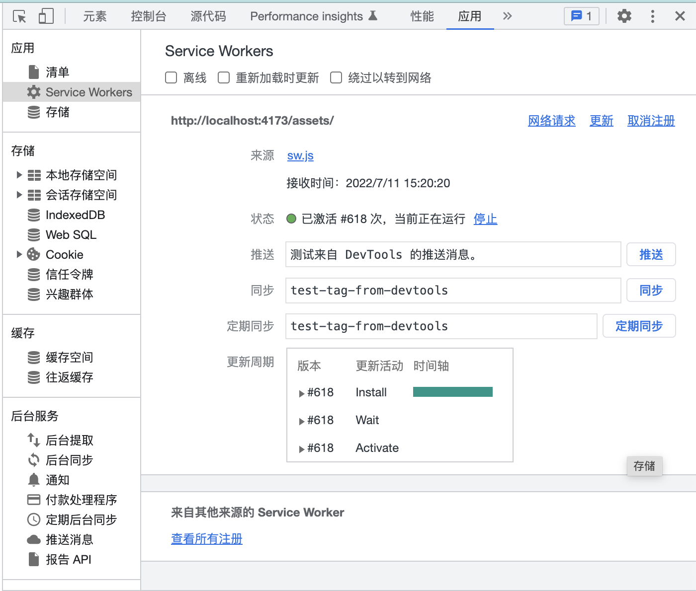

Service Worker Demo
=============

The demo contains a minimal react app for registering service workers to receive notifications. Steps for operation are listed below.

1. run `yarn && yarn dist` to install the dependencies and build a dist version out. Run `yarn preview` to run the built dist version.
2. use node.js to launch the dummy backend `node server/main.js`.
3. Visit [localhost:4173](localhost:4173) to preview the web page. Press <kbd>F12</kbd> to open developer panel, press the `request for notification permission` button, then accept the prompt that popped out.
4. Check the Service Worker menu in the developer panel of the Chrome/Firefox browser, you can see the service worker has been installed into the browser. 

5. Now execute `curl http://localhost:4000/send-notification` to let the dummy backend emit a notification. Then you should be able to receive the notification in the browser. Now even when the browser tab is closed, you will still be able to receive the notification via browser push.
